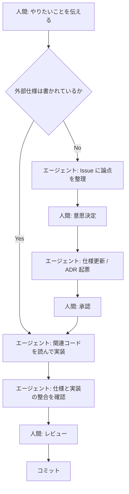

# 開発の進め方

このプロジェクトの**コードはすべて AI エージェント**（Claude Code / Codex など）が書きます。
そのため進め方が一般的な OSS と異なります。

> エージェントが**守るべき規約**は [CLAUDE.md](CLAUDE.md) にあります。
> この文書は規約を再掲せず、**進め方**だけを書きます。

## 役割分担

| 役割 | 担当 |
| --- | --- |
| 要求を出す | 人間 |
| 論点を整理し、選択肢を提示する | エージェント |
| **意思決定する** | 人間 |
| 仕様・ADR を書く | エージェント（人間が承認） |
| 実装・テストを書く | エージェント |
| レビューして受け入れる | 人間 |

**エージェントは決めません。** 選択肢とトレードオフを出すところまでが仕事で、
どれを採るかは人間が決めます。決まったら ADR に残します。

## 1 タスクの流れ

要点は 2 つ。

- **ユーザーに見える振る舞いは、仕様が無い状態で実装しない。**
- **内部の作りは仕様を待たない。コードで表現する**。
  そのぶん、実装前に関連コードを読むことが必須になります。

## エージェントへの依頼の書き方

良い依頼には次が揃っています。

1. **参照すべき文書**（`docs/spec/requirements.md` の該当要求 ID、など）
2. **完了条件**（何ができていれば終わりか）
3. **触ってよい範囲**（どのファイルまで変更してよいか）

悪い例:

> 遠征タイマーを作って

良い例:

> FR-nnn を実装して。仕様は `docs/spec/external/information-view.md`。
> 表示だけでよく、通知（FR-mmm）は含めない。

> **要求（FR / NFR）は現在 TBD です。**
> 確定するまで、この形の依頼はできません（[requirements.md](docs/spec/requirements.md)）。

## 意思決定が必要になったとき

エージェントは推測で進めず、**GitHub Issue に論点を書き出して**確認を求めます。
決着したら ADR を起票し、Issue にリンクを貼って閉じます。

リポジトリ内に暫定メモのファイルは作りません。

## 複数のエージェントを併用する

Claude Code / Codex など複数のエージェントを使う前提です。そのため:

- ツール非依存の規約は [CLAUDE.md](CLAUDE.md) と [docs/](docs/) に置く（どのエージェントも読める）
- ツール固有の設定だけを `.claude/` に置く
- 別のエージェント用の設定ファイルが必要になったら、
  `CLAUDE.md` を参照させる形にして**内容を二重管理しない**

## 文書の置き場所

| 知りたいこと | 場所 |
| --- | --- |
| なぜそう決めたか | [docs/adr/](docs/adr/) |
| 何を作るか | [docs/spec/](docs/spec/) |
| どう書くか（横断規約） | [docs/guidelines/](docs/guidelines/) |
| 実装の詳細 | **コード**（文書化しない） |
| 検討中の論点 | GitHub Issue |

運用ルールの詳細は [docs/README.md](docs/README.md)。

## コミット

規約は [CLAUDE.md](CLAUDE.md) §4（Conventional Commits）に従います。
**仕様変更と実装を同じコミットに混ぜません。** 順序は仕様が先です。

**当分の間、ブランチは切らず `main` に直接コミットします**。
並行作業も外部からの Pull Request もまだ無く、レビューは対話で完結しているためです。
並行作業・外部貢献・CI 導入のいずれかが始まった時点で見直します。
