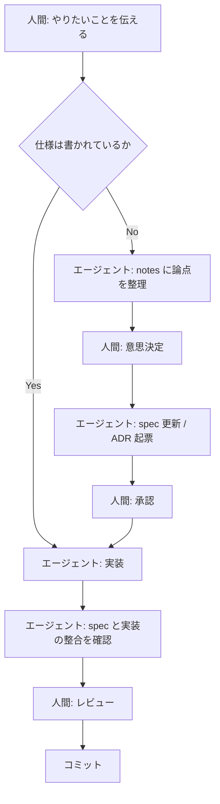

# エージェント駆動開発の進め方

実装はすべて AI エージェントが行う（[ADR-0003](../adr/0003-agent-driven-development.md)）。
その前提で、人間とエージェントがどう作業を回すかの手順。

## 役割分担

| 役割 | 担当 |
| --- | --- |
| 要求を出す | 人間 |
| 論点を整理し、選択肢を提示する | エージェント |
| **意思決定する** | 人間 |
| 仕様書・ADR を書く | エージェント（人間が承認） |
| 実装・テストを書く | エージェント |
| レビューして受け入れる | 人間 |

エージェントは**決めない**。選択肢とトレードオフを出すところまでが仕事で、
どれを採るかは人間が決める。決まったら ADR に残す。

## 1 タスクの流れ

要点は 1 つだけ。**仕様が無い状態で実装を始めない。**

## エージェントへの依頼の書き方

良い依頼には次が揃っている。

1. **参照すべき文書**（`docs/spec/requirements.md` の FR-010 を実装して、など）
2. **完了条件**（何ができていれば終わりか）
3. **触ってよい範囲**（どのファイルまで変更してよいか）

悪い例: 「遠征タイマーを作って」
良い例: 「FR-010 を実装して。仕様は `docs/spec/features/expedition-timer.md`。
表示だけでよく、通知（FR-020）は含めない。」

## 意思決定が必要になったとき

エージェントは推測で進めず、以下を行う。

1. `docs/notes/YYYY-MM-DD-<topic>.md` に論点を書く
2. 選択肢とトレードオフを並べる（**推奨案は挙げてよいが、決定はしない**）
3. 人間に確認を求める
4. 決まったら ADR を起票し、メモを昇格させる

## スキルを使う

反復する作業は `.claude/skills/` に型がある。該当するときは必ず使う。

| スキル | いつ使うか |
| --- | --- |
| `write-adr` | 設計判断を記録するとき |
| `write-spec` | 仕様を新規作成・更新するとき |
| `capture-note` | 調査・検討の途中経過を残すとき |
| `docs-audit` | ドキュメントの整合性・鮮度を点検するとき |

## コミットとブランチ

- コミット規約は [CLAUDE.md](../../CLAUDE.md) §4（Conventional Commits）。
- 1 コミット 1 目的。**仕様変更と実装を同じコミットに混ぜない。**
  順序は「仕様 → 実装」。仕様のコミットが先にあることで、
  あとから「何を根拠に実装したか」が履歴から辿れる。
- ブランチ運用は `TODO(未確定)`。当面は `main` 直コミットとし、
  規模が大きくなった時点で ADR を起票して決める。

## 作業を終えるとき

[CLAUDE.md](../../CLAUDE.md) §5 の完了条件を満たしているか確認する。
特に**「作業中に作った暫定メモを畳んだか」**は忘れやすい。

## 複数のエージェントを併用する

Claude Code / Codex など複数のエージェントを使う前提。そのため:

- ツール非依存の規約は `CLAUDE.md` と `docs/` に書く（どのエージェントも読める）
- ツール固有の設定だけを `.claude/` に置く
- 別のエージェント用の設定ファイルが必要になったら、
  `CLAUDE.md` を参照させる形にして**内容を二重管理しない**
