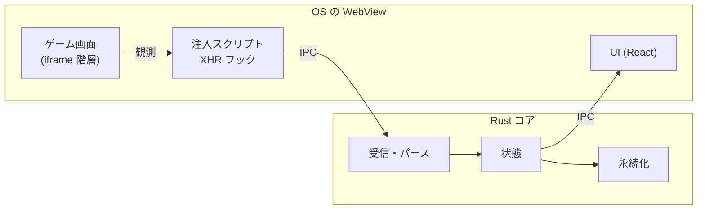

# 基本設計

**機能をまたいで効く構造**だけを書く。個別機能の実装詳細は書かない —— コードが正
（[ADR-0008](../adr/0008-code-as-source-of-truth.md)）。

> ステータス: **技術構成に由来する部分は確定**（[ADR-0016](../adr/0016-tech-stack.md)）。
> 要求が TBD のため、データの持ち方と機能構成は未確定。

## この文書に書くこと / 書かないこと

| 書く | 書かない（→ コード） |
| --- | --- |
| 全体をどんな塊に分けているか、その境界 | 各クラス・関数の構造 |
| 塊どうしが何をやり取りするか（約束事） | 具体的な呼び出し手順 |
| データをどこに、どういう原則で持つか | テーブル定義・スキーマ |
| 外部（ゲーム通信・OS）との接点の置き方 | 個別 API のパース処理 |
| 機能追加時に必ず従う構造上の制約 | 個別機能の振る舞い（→ [`external/`](external/)） |

判断の目安: **その記述が古くなったとき、実装者が誤った前提を持つか？**
持つなら書く。単に「今こう書いてある」だけならコードに任せる。

**なぜその構造にしたか**は [ADR](../adr/) に書く。この文書は「いまどういう構造か」を現在形で書く。

## 全体構造

| 構成要素 | 責務 | 他との境界 |
| --- | --- | --- |
| 注入スクリプト（JS） | ゲームのフレーム内で XHR を観測し、Rust へ渡す | **ページ内でのみ動く。判断を持たない** |
| Rust コア | 受信・パース・状態保持・永続化 | ゲームのページを直接触らない |
| UI（React / TypeScript） | 表示と操作 | Rust コアから受け取った状態のみを描画する |

Rust と WebView の橋渡しは Tauri が担う。

## 外部との接点

ゲームとの唯一の接点は**注入スクリプトによる XHR の観測**である。

- **全フレームに注入する。** ゲーム本体は DMM のページ内の iframe
  （`osapi.dmm.com` → `*.kancolle-server.com`）で動作しており、
  メインフレームだけに注入しても `/kcsapi/` を観測できない
- 観測対象は `/kcsapi/` 配下のみ。レスポンスは `svdata=` を除去して JSON として扱う
- **絞り込みは注入スクリプトの中で行う。`/kcsapi/` 以外は Rust コアへ渡さない。**
  フックはゲーム以外の通信（広告配信・トラッキング・SNS ウィジェット等）も観測できてしまう。
  実測では `/kcsapi/` 18 件に対し、それ以外が 216 件だった（2026-08-02）。
  IPC を通してから捨てるのでは、無関係な通信内容が一度アプリ側に渡る。
  **境界はページ内に置く**（[C-04](constraints.md)）
- **`fetch` と WebSocket は使われていない**（実測。2026-08-02）。
  ただし将来使われる可能性はあるため、`TODO(要検証)` として定期的に確認する

### 読み取り専用を構造として保証する方法

[C-02](constraints.md)（通信は読み取り専用）は、次の構造で担保する。

- 注入スクリプトは `XMLHttpRequest` を**サブクラス化し、`loadend` を購読するだけ**とする。
  リクエストの停止・改変・再送・追加送信を行わない
- **プロキシを置かない。** ゲームとサーバの通信経路に一切介入しない
- 送信系の API（`open` / `send`）は引数を記録するのみで、内容を書き換えない

この方針を破る変更は、[C-02](constraints.md) 違反として扱う。

### 非公開仕様への依存を局所化する境界

- 艦これの API 構造に依存する知識は**パース層に閉じ込める**（[C-03](constraints.md) / NFR）
- 未知のフィールド・構造変化を受け取っても**停止せず、既知の範囲で処理を続ける**。
  縮退はパース層で行い、それより内側へ不完全なデータを流さない

## データの持ち方

`TODO(未確定)`: 要求（[requirements.md](requirements.md)）が TBD のため保留。

決まった時点で書くこと:

- 何を永続化し、何をメモリに留めるか
- 保存場所（ユーザーから辿れること）
- 認証情報を保存しない仕組み（[constraints.md](constraints.md) C-04 / C-07）

**確定している制約**: `api_start2/getData` は 2MB 超（実測）。
マスタデータは毎回取得されるため、扱い方を設計時に決める必要がある。

## 機能追加時の構造上の制約

- **ゲームのページに副作用を与えない。** 注入スクリプトは観測に徹する
- **UI はゲームの通信を直接見ない。** 必ず Rust コアを経由する
- 新しい観測対象を増やす場合も、経路は注入スクリプト 1 本に保つ

## 未解決事項

- `TODO(未確定)`: データの持ち方（上記）
- `TODO(未確定)`: Rust と TypeScript の間の型の受け渡し方法
- `TODO(要検証)`: Windows（WebView2）での動作確認。macOS のみ実測済み
