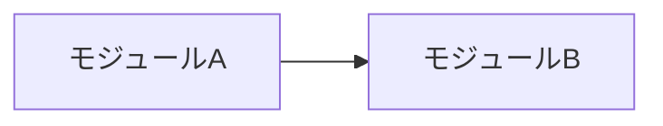

# 内部仕様: ここに機能名

> このファイルは `docs/spec/internal/<機能名>.md` にコピーして使うテンプレート。
> コピー後、この引用ブロックは削除する。
>
> **ここには「どう実現するか」だけを書く。** ユーザーから見える振る舞いは
> 外部仕様（`docs/spec/external/<機能名>.md`）に書き、ここでは参照するに留める。
> **外部仕様を変えない限り、エージェントの判断で更新してよい**
> （[ADR-0006](../../adr/0006-split-external-and-internal-spec.md)）。

- 対応する外部仕様: `docs/spec/external/<機能名>.md`
- 関連 ADR: ADR-nnnn
- ステータス: ドラフト | 確定

## 構成

責務の分割と、それぞれが何を知っているか。

| モジュール | 責務 | 依存先 |
| --- | --- | --- |
| | | |

## データモデル

保持するデータの構造と、その寿命（メモリのみ / 永続化 / キャッシュ）。

| 名前 | 構造 | 保存先 | 寿命 |
| --- | --- | --- | --- |
| | | | |

## 処理フロー

主要な処理の流れ。分岐と、どこで失敗しうるかを示す。

## 入力データの取得元

| 項目 | 型 / 形式 | 取得元 | 根拠 |
| --- | --- | --- | --- |
| | | | `TODO(要検証)` |

> 艦これの API 構造は非公開のため、取得元には**根拠（実測日 / 参照 OSS）を必ず書く**
> （[constraints.md](../constraints.md) C-03）。根拠が無い記述には `TODO(要検証)` を付ける。
> 参照した OSS がある場合はライセンス表記を確認する（C-07）。

## エラー処理と縮退動作

| 状況 | 内部の挙動 | 外部仕様との対応 |
| --- | --- | --- |
| 未知のフィールド / 構造変化 | （停止しない。NFR-003） | |
| 取得失敗・タイムアウト | | |
| 永続化の失敗 | | |

**ゲームサーバへのリトライ・再送は行わない**（[constraints.md](../constraints.md) C-02）。

## 性能・リソース

- 処理頻度と 1 回あたりの想定コスト
- メモリ・ディスクの増加要因と上限（NFR-006）
- ゲーム画面の操作レスポンスに影響しないための方針（NFR-002）

## テスト方針

| 対象 | テストの種類 | 確認すること |
| --- | --- | --- |
| | | |

外部仕様の「受け入れ条件」と対応させる。

## 変更時の影響範囲

この内部仕様を変更したとき、他に波及する箇所。
**ここが外部仕様に及ぶ場合は、人間の承認が必要になる。**

## 未解決事項

- `TODO(未確定)`:
